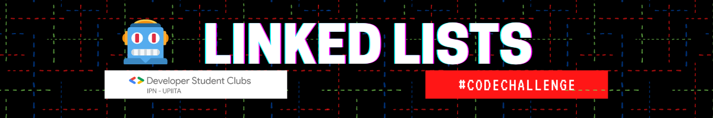

  

# Listas Enlazadas (Linked Lists)

> *"R2D2, ¿Te lo dijo la computadora central de la ciudad? ¡R2D2, sabes bien que no debes confiar en una computadora extraña!"
-- C3PO*

---

Bienvenido a la segunda serie de retos del #CodeChallenge🤖 traído a ti por el DSC IPN-UPIITA, en esta ocasión te retamos a resolver 3 problemas de dificultad variada sobre listas enlazadas.

Te compartimos a continuación una breve descripción de los retos y el enlace donde puedes verlo más detallado y probar tu código!

No olvides que cuando tengas tu código respuesta, debes mandarlo al inbox de la página de facebook del [DSC IPN-UPIITA](https://www.facebook.com/dscipnupiita)

## Reto 1: Suma dos números
---
Se te entregan dos listas enlazadas donde cada una representa un entero no negativo, los dígitos del número están ordenados al revés y cada nodo de la lista contiene el valor de un único dígito. Hay que sumar los dos números y entregar el resultado como una lista enlazada ordenada al revés

Ejemplo:

%207e6d730b73364a469ed71f66a047c883/Untitled.png)

🔗👉Enlace del problema completo: [https://leetcode.com/explore/interview/card/top-interview-questions-medium/107/linked-list/783/](https://leetcode.com/explore/interview/card/top-interview-questions-medium/107/linked-list/783/) 

## Reto 2: Encuentra el nodo de unión de dos listas
---
Dadas dos listas enlazadas, cuyo primer nodo se asegura diferente a *Null* y se unen en algún punto, encontrar ese punto y regresar el valor que contiene

Ejemplo:

%207e6d730b73364a469ed71f66a047c883/Untitled%201.png)

Salida:

%207e6d730b73364a469ed71f66a047c883/Untitled%202.png)

🔗👉Enlace del problema completo: [https://www.hackerrank.com/challenges/find-the-merge-point-of-two-joined-linked-lists/problem?h_l=interview&playlist_slugs[]=interview-preparation-kit&playlist_slugs[]=linked-lists](https://www.hackerrank.com/challenges/find-the-merge-point-of-two-joined-linked-lists/problem?h_l=interview&playlist_slugs%5B%5D=interview-preparation-kit&playlist_slugs%5B%5D=linked-lists)

## Reto 3: Detectando ciclos en una lista enlazada
---
El título de este reto explica muy bien el objetivo, hay que escribir una función que pueda detectar si en una lista enlazada existe un ciclo, es decir, al recorrer la lista, algún nodo hace referencia a un nodo ya visitado.

Ejemplo:

%207e6d730b73364a469ed71f66a047c883/Untitled%203.png)

🔗👉Enlace del problema completo: [https://www.hackerrank.com/challenges/ctci-linked-list-cycle/problem?h_l=interview&playlist_slugs[][]=interview-preparation-kit&playlist_slugs[][]=linked-lists](https://www.hackerrank.com/challenges/ctci-linked-list-cycle/problem?h_l=interview&playlist_slugs%5B%5D%5B%5D=interview-preparation-kit&playlist_slugs%5B%5D%5B%5D=linked-lists)