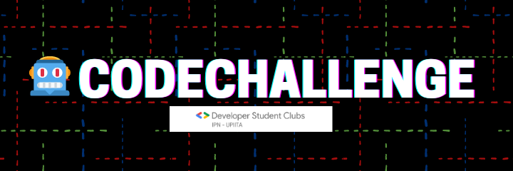

<h1 align="center">🤖CodeChallenge</h1>
<h2 align="center">🧪Practica tus habilidades en Algoritmia💻</h2>

<p align="center">
  
</p>

[](http://commonmark.org) [](http://makeapullrequest.com) 
[](https://discord.gg/jkQxdVUn)

## Bienvenido
---
Estás en el repositorio del CodeChallenge del Google Developer Student Club IPN-UPIITA.
Aquí encontrarás los diferentes retos que se van presentando a la comunidad cada dos semanas.

Es muy fácil participar, simplemente tienes que estar al tanto de las publicaciones en la página de [Facebook](https://www.facebook.com/dscipnupiita) y cuando hayas terminados tus códigos para cada reto puedes mandarlo a nuestro Inbox o mandar un PR y nosotros lo revisaremos.

 
## ¿Cómo hacer un Pull Request para enviar mis códigos? 
---
- Crea un Fork de este repositorio, lo puedes hacer con el botón de "Fork" en la esquina superior derecha
- Esto creará una copia idéntica de este repositorio en tu cuenta de Github
- Con Git, clona tu repositorio en tu computadora, encontrarás dentro de la carpeta del tema que quieras resolver otra carpeta llamada "codigos"

```bash
git clone 
```

- Adentro de esta carpeta escribe un archivo con las funciones que resuelvan los problemas
- Utiliza el lenguaje que más te guste
- Por favor, nombra tu archivo de la siguiente manera ***tema_nombre/nick.extension***, ejemplo: *linkedLists_jerts.py*
- Cuando termines crea un commit con tus cambios y haz un push a tu repositorio
- Esto te permitirá hacer un Pull Request desde tu repositorio hacia este.
- Y listo, manda tu Pull Request con un comentario o no, nosotros lo revisaremos 😉

## Nuestras redes sociales
---
| Red Social | Link |
| ------ | ------ |
| Facebook| [Developer Student Club Facebook](https://www.facebook.com/dscipnupiita) |
| Instram | [Developer Student Club Instagram](https://www.instagram.com/dscipnupiita/) |
| Twitter | [Developer Student Club Twitter](https://twitter.com/dscipnupiita) |
| Discord | [Developer Student Club Discord](https://discord.gg/jkQxdVUn) |


